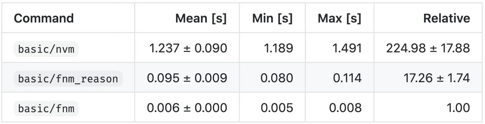

# Installing Node v16

Some project require different versions of Node to run. This means you need to manage your Node versions.

There are a few options to manage Node versions:

- [nvm](https://github.com/nvm-sh/nvm)
- [fnm](https://github.com/Schniz/fnm)

You only need to choose one of them. `fnm` seems to load a bit faster than `nvm`.



## Installing `fnm`

Source: [https://github.com/Schniz/fnm](https://github.com/Schniz/fnm)

### With cURL

```sh
curl -fsSL https://fnm.vercel.app/install | bash
```

or:

### With Homebrew

```sh
brew install fnm
```

## Setting up `fnm`

```sh
eval "$(fnm env --use-on-cd)" >> ~/.zshrc
```

and:

```sh
source ~/.zshrc
```

## Installing Node v16

```sh
fnm install v16
```

## Use Node v16

```sh
fnm use v16
```
